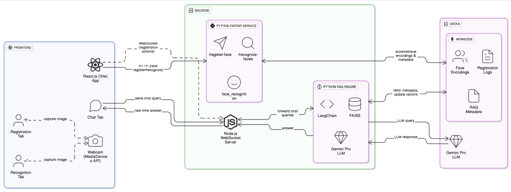

# Face Recognition Platform with Real-Time AI Q&A

A modular, clean, and scalable platform that combines face recognition with a RAG (Retrieval-Augmented Generation) system for real-time AI Q&A about registered users.

## 🚀 Features

- **Face Registration**: Register faces with associated metadata
- **Real-Time Face Recognition**: Identify registered faces through webcam
- **AI-Powered Q&A**: Ask questions about registered users using RAG technology
- **WebSocket Communication**: Real-time chat interface

## 🏗️ Architecture

The application follows a microservice architecture:

1. **Frontend (React + Vite)**
   - Registration interface
   - Recognition interface
   - Chat interface

2. **Backend**
   - Python Face Recognition API
   - RAG Engine (LangChain + FAISS + OpenAI)
   - Node.js WebSocket Server

3. **Database**
   - MongoDB for storing face encodings and metadata



## 🛠️ Setup Instructions

### Prerequisites
- Node.js (v16+)
- Python (3.8+)
- MongoDB (local or Atlas)
- OpenAI API Key

### Installation

1. **Clone the repository**
   ```
   git clone <repository-url>
   cd face-rag-platform
   ```

2. **Set up the Python backend**
   ```
   cd backend/face_api
   pip install -r ../../requirements.txt
   ```

3. **Set up the Node.js WebSocket server**
   ```
   cd ../node_ws_server
   npm install
   ```

4. **Set up the React frontend**
   ```
   cd ../../frontend
   npm install
   ```

5. **Environment Variables**
   - Create `.env` files in both backend directories with necessary API keys and configuration

### Running the Application

#### Option 1: Using the Batch Script (Recommended for Windows)

A batch script is provided to start all components with a single command:

```
.\run_project.bat
```

This will:
1. Start the Python Face API backend
2. Start the Node.js WebSocket Server
3. Start the React Frontend

After running the script, access the application at `http://localhost:5173`

#### Option 2: Starting Components Manually

1. **Start MongoDB** (if using local instance)
   ```
   mongod
   ```

2. **Start the Python Face API**
   ```
   cd backend/face_api
   python simple_app.py
   ```

3. **Start the Node.js WebSocket Server**
   ```
   cd backend/node_ws_server
   node index.js
   ```

4. **Start the React Frontend**
   ```
   cd frontend
   npm run dev
   ```

5. **Access the application** at `http://localhost:5173`

## 📝 Usage

1. **Registration**: Navigate to the Registration tab, capture your face using the webcam, and enter your name
2. **Recognition**: Go to the Recognition tab to see real-time face recognition
3. **Chat**: Use the Chat tab to ask questions about registered users
4. **User Management**: In the Registration tab, scroll down to see and manage registered users

### User Management

The platform includes a user management interface that allows you to:

- View all registered users
- See when each user was registered
- Delete users when needed

To delete a user:
1. Go to the Registration tab
2. Scroll down to the "Registered Users" section
3. Click the "Refresh List" button to see all registered users
4. Click the "Delete" button next to the user you want to remove
5. Confirm the deletion when prompted

## 🧩 Project Structure

```
face-rag-platform/
│
├── frontend/ (React + Vite)
│ ├── src/
│ │ ├── components/
│ │ │ ├── RegistrationTab.jsx
│ │ │ ├── RecognitionTab.jsx
│ │ │ ├── ChatTab.jsx
│ │ │ └── RegisteredUsers.jsx
│ │ ├── App.jsx
│ │ ├── main.jsx
│ │ └── index.css
│ ├── vite.config.js
│ └── package.json
│
├── backend/
│ ├── face_api/ (Python)
│ │ ├── app.py                 # Original implementation
│ │ ├── simple_app.py          # Simplified implementation without face_recognition dependency
│ │ ├── rag_engine.py          # Original RAG engine
│ │ ├── simple_rag_engine.py   # Simplified RAG engine
│ │ ├── face_utils.py          # Original face utilities
│ │ ├── face_utils_mock.py     # Mock face utilities
│ │ └── db.py                  # Database operations
│ ├── node_ws_server/
│ │ ├── index.js
│ │ └── package.json
│
├── run_project.bat            # Batch script to run all components
├── requirements.txt
├── Project_Architecture.png   # Architecture diagram
└── README.md
```

## 📊 Hackathon Submission

This project was created for the [Katomaran Hackathon](https://katomaran.com).

## 🎬 Video Implementation

Watch the video demonstration of the Face Recognition Platform in action:

[**Watch Demo Video**](https://drive.google.com/uc?id=1pfEuyuPnWE07ujbh5sTpT-_TcNRE-R3q&export=download)

The video showcases the key features of the platform, including face registration, real-time recognition, and the AI-powered Q&A system.

## 📄 License

MIT
